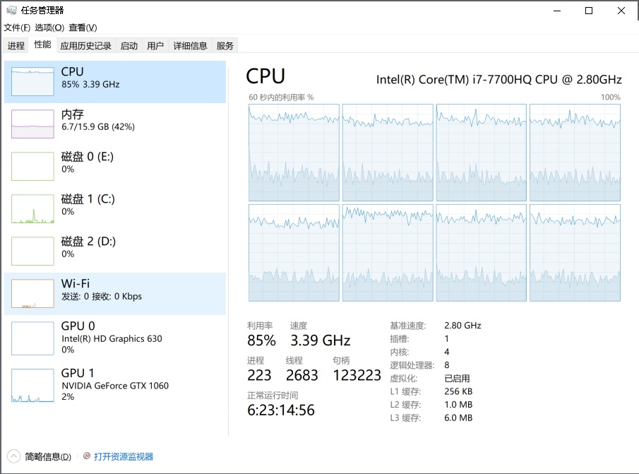

# pySample-DarknetDll
Python call Darknet Dll (GPU version) in Windows

<b>GPU Ver : python call darknet dll (GPU)</b>
1) Download the "yolov3.weights" file by https://pjreddie.com/media/files/yolov3.weights 
2) Move "yolov3.weights" to "mod" folder
3) Run "darknet-f.py" to detect some images
4) Run "darknet-v.py" to detect a video

<b>CPU Ver : python call cv.dnn.readNetFromDarknet()</b>
1) Run "opencv-yolo3-f.py" to detect some images
2) Run "opencv-yolo3-v.py" to detect a video

<b>GPU Vs. CPU</b> 
Notebook : VULCAN game notebook  
OS  : Win10 Home  
CPU : i7-770HQ 2.8GHz  
RAM : 16G  
GPU : GTX1060 - 6G , CUDA 10.1  

<b>Result</b> 
1) CPU :  FPS<2.5 ; CPU>80% , affect other apps operations
2) GPU :  FPS>4.5 ; CPU<25$ , don't affect other apps operations

